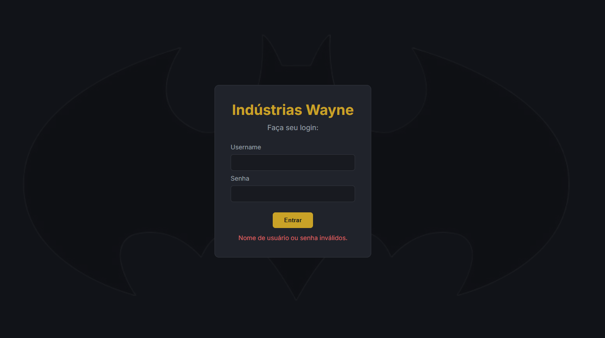
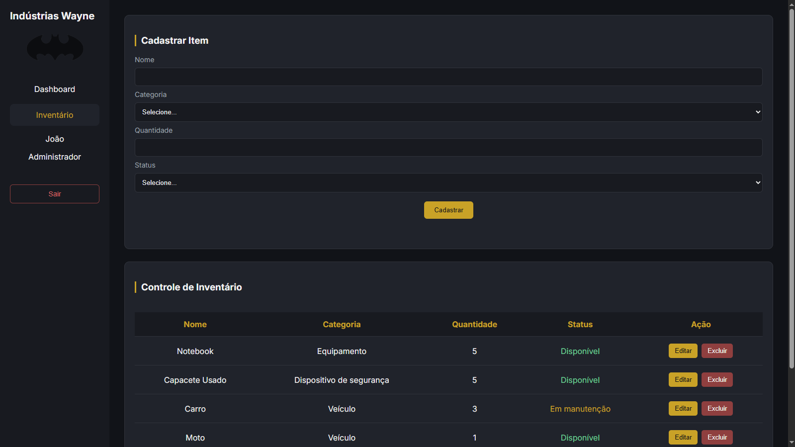
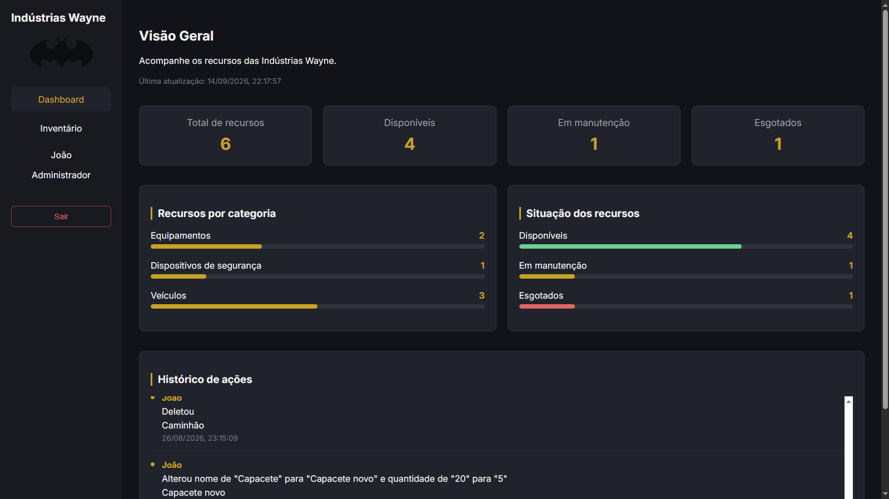

# Sistema de Inventário - Indústrias Wayne

Sistema web de gerenciamento de inventário desenvolvido com JavaScript, Node.js, Express e MySQL.

A aplicação permite gerenciar recursos do inventário, acompanhar suas quantidades, categorias e status, além de possuir autenticação e diferentes níveis de acesso.

## Funcionalidades

* Login com autenticação utilizando MySQL
* Controle de acesso por nível de usuário

  * Funcionário
  * Gerente
  * Administrador
* Gerenciamento de inventário

  * Listagem de itens
  * Cadastro de itens
  * Edição de itens
  * Exclusão de itens
* Validação dos dados enviados ao backend
* Dashboard com informações gerais do inventário
* Histórico de alterações
* Interface responsiva
* Integração entre frontend, backend e banco de dados

## Tecnologias utilizadas

* HTML
* CSS
* JavaScript
* Node.js
* Express
* MySQL
* Git e GitHub

## Como executar

1. Clone o repositório.

2. Instale as dependências:

```bash
npm install
```

3. Crie um arquivo `.env` na raiz do projeto com as informações de conexão do banco de dados e a chave da sessão:

```env
DB_HOST=localhost
DB_USER=root
DB_PASSWORD=sua_senha
DB_NAME=industriaswayne
SESSION_SECRET=sua_chave_secreta
```

4. Configure o banco de dados MySQL e execute o arquivo `inserts.sql` para inserir os dados iniciais.

5. Inicie o servidor:

```bash
node --watch app.js
```

6. Acesse a aplicação pelo endereço local configurado pelo servidor.

## Screenshots

### Login



### Inventário



### Dashboard



## Documentação

A documentação do projeto está disponível no arquivo `documentacao.pdf`.

## Status

Concluído.

